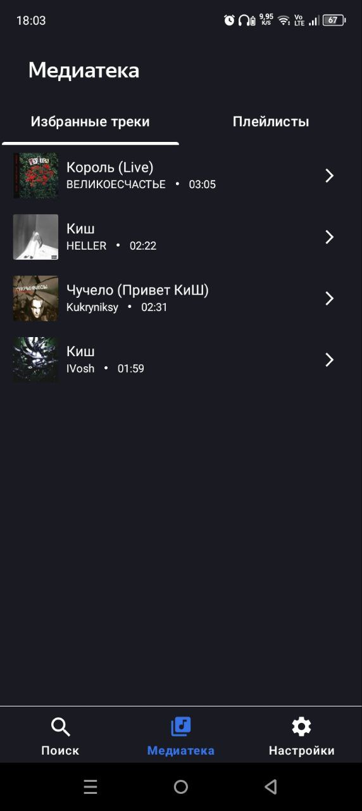
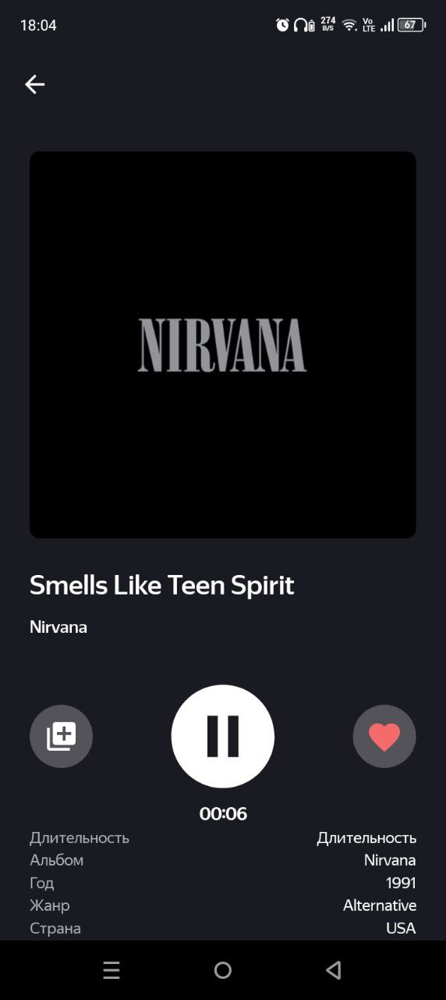
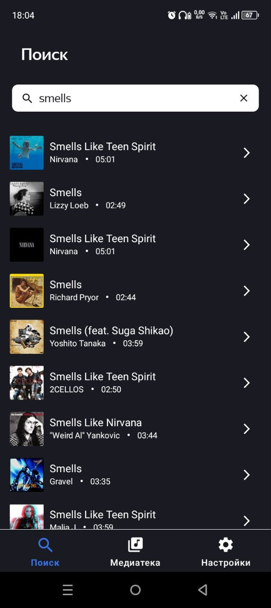

<h1 align="center">🎵 PlaylistMaker</h1>

  Android-приложение для создания музыкальных плейлистов с использованием iTunes API.

---

### 🧠 О проекте

Playlist Maker — это Android-приложение, которое позволяет искать музыку по публичной базе iTunes, прослушивать превью треков, добавлять избранные композиции и формировать собственные плейлисты с обложками и описаниями. Все данные хранятся на устройстве пользователя с помощью Room.

---

### 📱 Скриншоты

  
  
  

---

### 🧰 Технологии

  
- Язык: Kotlin
- Архитектура: MVVM
- DI: Koin
- Хранилище: Room Database
- Асинхронность: Kotlin Coroutines
- Сетевые запросы: Retrofit, Gson
- Навигация: Jetpack Navigation Component, SingleActivity + Fragments
- UI: ViewPager2, ConstraintLayout, ViewBinding
- Работа с изображениями: Glide

---

### 🧭 Экранная структура

- 🔍 Поиск
- 🎧 Проигрыватель трека
- 📚 Медиатека (избранное и плейлисты)
- 📝 Создание / редактирование плейлиста
- ⚙️ Настройки

---

### ⚙️ Установка

- Откройте проект в Android Studio
- Синхронизируйте Gradle
- Запустите на Android 10+ (SDK 29)
